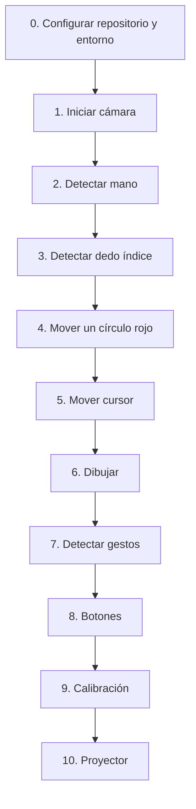

# Proyecto: Proyección Interactiva (Touch Wall)

Este proyecto tiene como objetivo transformar cualquier superficie de proyección ordinaria en una pantalla táctil o interactiva utilizando una cámara y técnicas de visión por computadora.

A continuación se detallan las ideas iniciales, el roadmap secuencial de objetivos y los requisitos del sistema.

---

## 📋 Roadmap Secuencial de Objetivos

Para construir el proyecto de manera progresiva y validar cada paso antes de avanzar, seguiremos la siguiente secuencia de desarrollo:

### Detalle de cada objetivo:
0. **Configurar repositorio y entorno**: Inicializar Git, configurar el repositorio remoto en GitHub, y crear el entorno virtual de Python con las dependencias necesarias.
1. **Iniciar cámara**: Levantar el flujo de video en tiempo real de la webcam usando OpenCV.
2. **Detectar mano**: Implementar el modelo de MediaPipe Hands para reconocer la mano en el flujo de video.
3. **Detectar dedo índice**: Identificar el landmark específico de la punta del dedo índice (Landmark #8 en MediaPipe).
4. **Mover un círculo rojo**: Dibujar un círculo rojo en una ventana gráfica de OpenCV que siga la posición del dedo índice en tiempo real.
5. **Mover cursor**: Usar las coordenadas del dedo para mover el cursor real del sistema operativo (usando una librería como `pyautogui` o `pynput`).
6. **Dibujar**: Implementar una pizarra digital donde se pueda pintar en pantalla arrastrando el dedo índice.
7. **Detectar gestos**: Programar gestos sencillos (por ejemplo, unir el pulgar y el índice para simular "hacer click" o "comenzar a dibujar").
8. **Botones**: Crear botones virtuales en pantalla que realicen acciones cuando el dedo interactúe con su área (por ejemplo, cambiar color de dibujo, borrar lienzo).
9. **Calibración**: Implementar una matriz de homografía (usando 4 esquinas de calibración) para mapear correctamente las coordenadas del dedo de la cámara a la pantalla proyectada, corrigiendo deformaciones de perspectiva.
10. **Proyector**: Integrar todo el sistema proyectándolo sobre una superficie física (pared, mesa), realizando los ajustes finales de luz y posición.

---

## ⚙️ Entorno y Recursos Mínimos (Fase Inicial)

Para la fase inicial, utilizaremos los recursos mínimos indispensables para que el desarrollo sea ágil y no requiera hardware especializado:

*   **Hardware**: 
    *   Una laptop.
    *   Una webcam (integrada o externa).
*   **Software y Lenguaje**:
    *   **Python**: Lenguaje principal de desarrollo.
    *   **OpenCV**: Para la captura, procesamiento y visualización de video (`opencv-python`).
    *   **MediaPipe**: Para la detección rápida y precisa de manos (`mediapipe`).
*   **Entorno Físico**:
    *   Un espacio bien iluminado para facilitar la detección de la webcam y evitar ruidos en el sensor de imagen.

